# 마룸모 (마이 룸에서 하는 스터디 모임)

하나의 플랫폼에서 진행되는 스터디 활동

## Table of Content

1. [서비스 개요](#1-서비스-개요)
1. [기술 스택](#2-기술-스택)
1. [한눈에 보는 시스템 아키텍처](#3-한눈에-보는-시스템-아키텍처)
1. [팀원 소개](#4-팀원-소개)
1. [BackEnd Structure](#5-backend-structure)
1. [FrontEnd Structure](#6-frontend-structure)
1. [Wire Frames](#7-wire-frames)
1. [ERD](#8-erd)

## 1. 서비스 개요

저희 서비스가 추구하는 목표는 **하나의 스터디 플랫폼에서 모든 것을 해결하자**입니다.

- 자신의 할일와 일정 관리를 간편하게 할 수 있고, 통계를 한 눈에 볼 수 있습니다
- 독립적인 스터디 룸을 만들어 스터디원들과 소통, 자료 공유, 일정 관리 등을 할 수 있습니다.
- 스터디 룸에서는 실시간 채팅, 화상 채팅, 게시판, 질문 게시판 등을 제공합니다

## 2. 기술 스택

### FrontEnd

| <div align="center"></div> | <div align="center"></div> | <div align="center"></div> |
| :-----------------------------------------------------------------------------------------------------: | :--------------------------------------------------------------------------------------------------: | :-------------------------------------------------------------------------------------------------------: |
|                                      &nbsp;&nbsp;HTML5&nbsp;&nbsp;                                      |                         &nbsp;&nbsp;&nbsp;&nbsp;CSS3&nbsp;&nbsp;&nbsp;&nbsp;                         |                                                JavaScript                                                 |

| <div align="center"> </div> | <div align="center">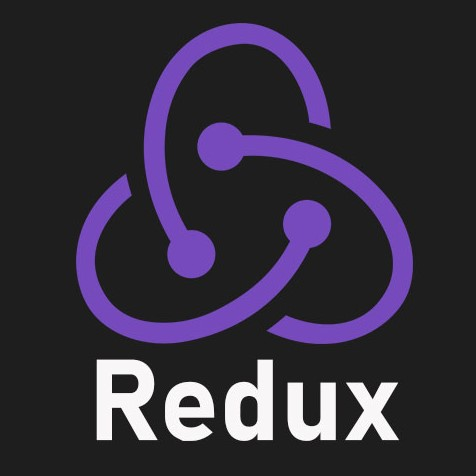 </div> |
| :------------------------------------------------------------------------------------------------------: | :--------------------------------------------------------------------------------------------------------: |
|                    &nbsp;&nbsp;&nbsp;&nbsp;&nbsp;React&nbsp;&nbsp;&nbsp;&nbsp;&nbsp;                     |                     &nbsp;&nbsp;&nbsp;&nbsp;&nbsp;Redux&nbsp;&nbsp;&nbsp;&nbsp;&nbsp;                     |                                                        Styled-components                                                        |

| <div align="center"> </div> | <div align="center"> </div> |
| :-------------------------------------------------------------------------------------------------------: | :-------------------------------------------------------------------------------------------------------------: |
|                                                   AXIOS                                                   |                                                    OpenVidu                                                     |

### BackEnd

| <div align="center"> </div> | <div align="center"> </div> | <div align="center"></div> | <div align="center"></div> | <div align="center"></div> |
| :----------------------------------------------------------------------------------------------------: | :-----------------------------------------------------------------------------------------------------------------: | :------------------------------------------------------------------------------------------------------------------------: | :-------------------------------------------------------------------------------------------------------: | :-------------------------------------------------------------------------------------------------------------: |
|                                                  Java                                                  |                                                     Spring-Boot                                                     |                                                      Spring-Security                                                       |                    &nbsp;&nbsp;&nbsp;&nbsp;&nbsp;Gradle&nbsp;&nbsp;&nbsp;&nbsp;&nbsp;                     |                                  &nbsp;&nbsp;&nbsp;Hibernate&nbsp;&nbsp;&nbsp;                                  |

| <div align="center"> </div> | <div align="center"></div> | <div align="center"></div> | <div align="center"></div> | 
| :--------------------------------------------------------------------------------------------------------: | :---------------------------------------------------------------------------------------------------------: | :-------------------------------------------------------------------------------------------------------------: | :-----------------------------------------------------------------------------------------------------: 
|                                                  MySQL                                                   |                                                    Websocket                                                    |                                                  mongoDB                                                  |                                                  swagger                                                  |

### DevOps

| <div align="center"> </div> | <div align="center"></div> | <div align="center"></div> | <div align="center">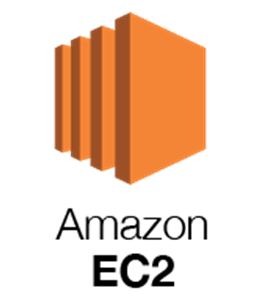</div> | <div align="center"></div> |
| :--------------------------------------------------------------------------------------------------------: | :---------------------------------------------------------------------------------------------------------: | :-----------------------------------------------------------------------------------------------------: | :-------------------------------------------------------------------------------------------------: | :-----------------------------------------------------------------------------------------------: |
|                                                   Docker                                                   |                                                   Jenkins                                                   |                                                  NginX                                                  |                                               AWS EC2                                               |                                              AWS S3                                               |

## 3. 한눈에 보는 시스템 아키텍처


## 4. 팀원 소개

이상민 (팀장): Backend 총괄 + Frontend 개발 + 프로젝트 관리


조현동 (팀원): Backend 개발 + 배포


오준호 (팀원): Backend 개발 + DB 관리


박유진 (팀원): Frontend 총괄 + 디자인


전태영 (팀원): Frontend 개발 + 발표


곽준영 (팀원): Frontend 개발

## 5. BackEnd Structure

```
BackEnd
.
└── main                           
    ├── java
    │   └── com
    │       └── a406
    │           └── mrm
    │               ├── common            
    │               │   ├── filter
    │               │   ├── handler
    │               │   └── util
    │               ├── config              
    │               │   ├── auth
    │               │   ├── jwt
    │               │   └── oauth
    │               │       └── provider
    │               ├── model            
    │               │    ├── entity
    │               │    └── dto
    │               ├── controller          
    │               ├── repository         
    │               └── service           
    └── resources                           
        ├── README.md
        ├── application.properties
        └── email.properties

```

## 6. FrontEnd Structure

```
FrontEnd
.
├── public                 
│   └── images          
└── src               
    ├── OCR    
    ├── sagas           
    ├── sagas        
    ├── slice              
    └── components     
        ├── Calendar    
        │   └── DatePicker   
        ├── Category   
        ├── DnD   
        │   └── styles   
        ├── GroupRoom   
        │   ├── Board   
        │   │   └── ArticlePage   
        │   ├── Chat   
        │   ├── GroupRoomItem   
        │   ├── TimeList  
        │   └── OpenVidu    
        ├── ImageUpload   
        ├── Login   
        ├── Modal   
        │   ├── Group   
        │   ├── Profile   
        │   └── Todo    
        ├── MyRoom   
        │   └── MyRoomItem   
        ├── ScheduleThings
        │   └── styles   
        └── TodoThings     
            └── styles   

```

## 7. Wire Frames

- 로그인 화면 (회원가입, 아이디 찾기, 비밀번호 찾기)

  

  <table>
    <tr>
      <td></td>
      <td>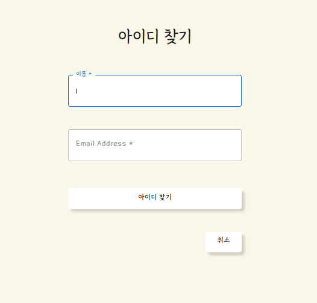</td>
      <td>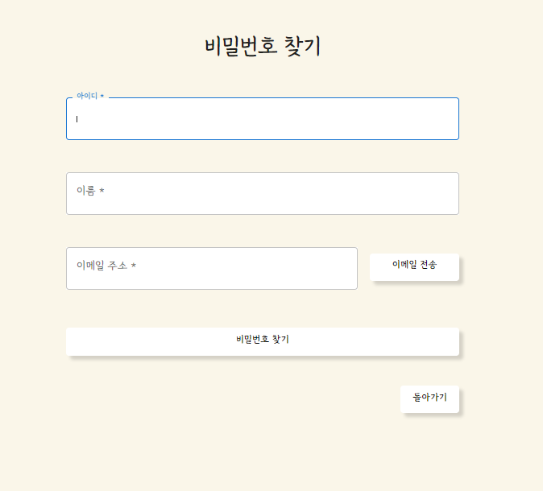</td>
    </tr>
  </table>


- 초기 메인 화면 (회원 가입후 첫 로그인 시)
  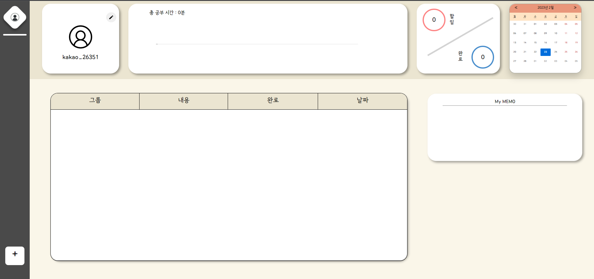

- 그룹 생성 및 참가
  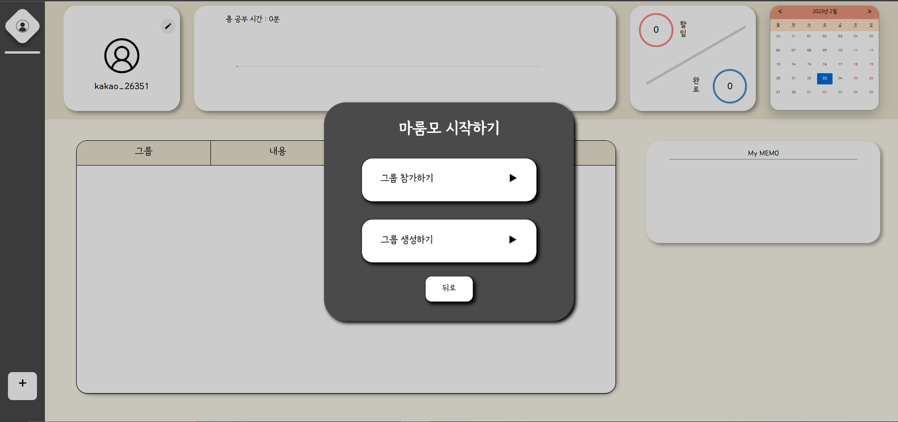

- 활성화 된 메인 화면 (자신의 todo list와 통계, 메모, 일정을 한눈에 볼 수 있다)
  

- 프로필 보기 및 수정
  

- 참가한 room의 화면 (게시판 종류, todo 관리, 메모, time table, 참가 인원 목록 등이 있다)
  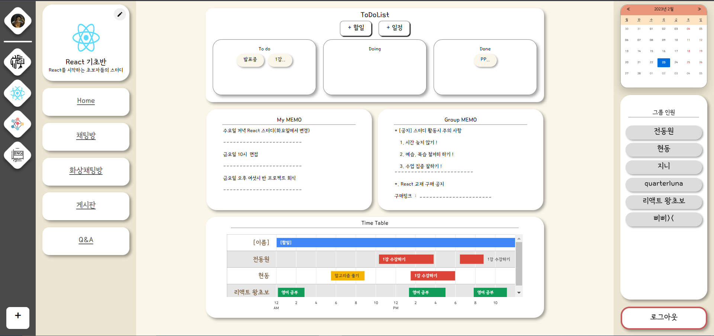

- 할일, 일정 생성 (원하는 날짜의 todo와 일정을 추가할 수 있다)
  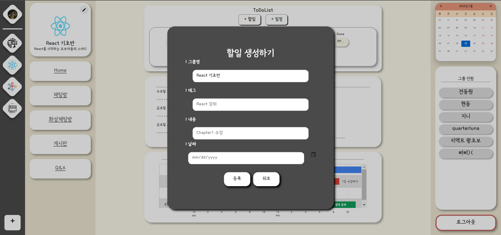
  

- 일정 화면 (오른쪽 상단 달력 클릭 시 확인할 수 있다)
   

- 채팅방 입장 화면
  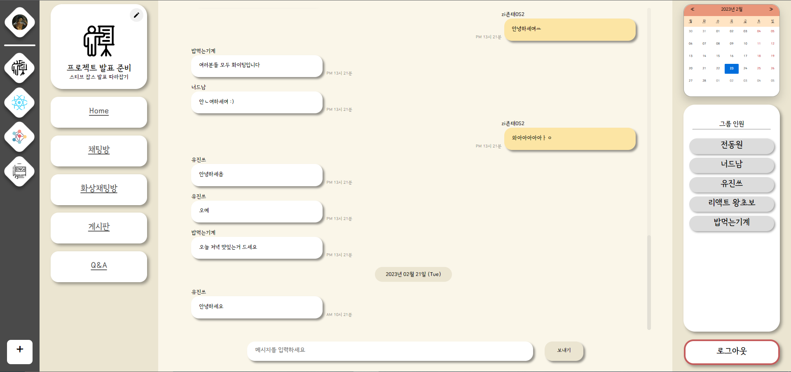

- 화상 채팅방 입장 화면
  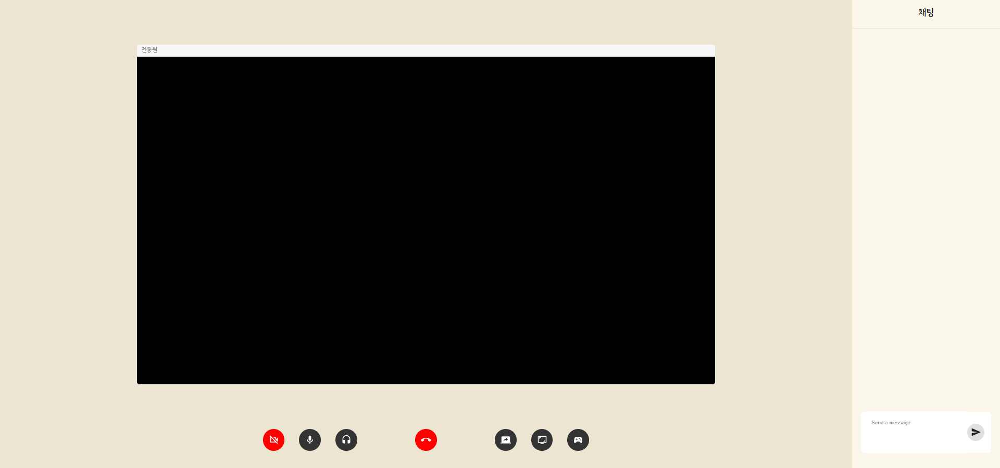

- 게시판 입장 화면
  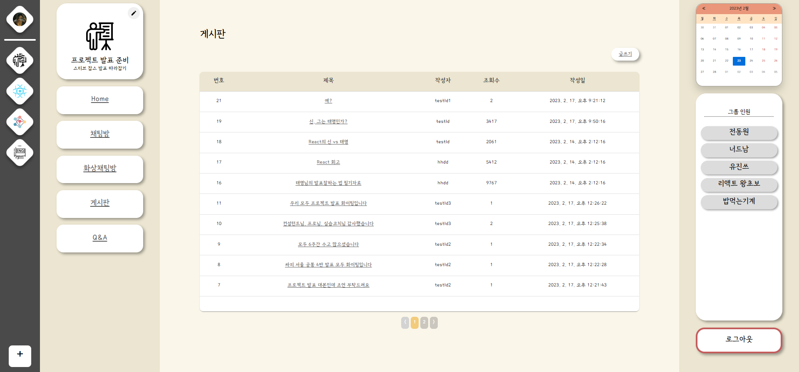

- Q&A 게시판 입장 화면
  

## 8. ERD


